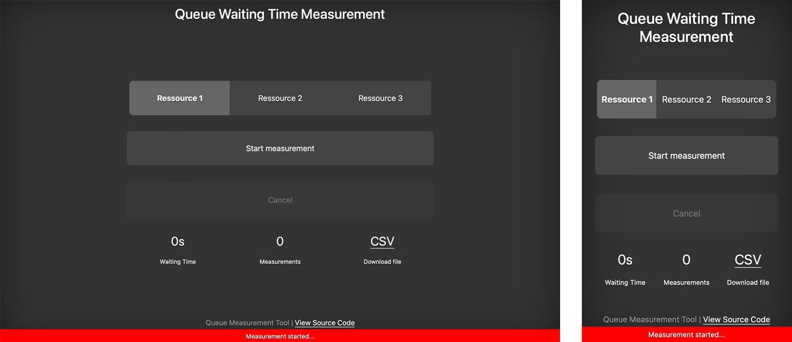

# ⏱️ Queue Time Measurment Tool

This tool is a Open Source tool to measure queue times easily with lightweight and reponsive web client.

-   🔄 Dynamically generated backend/frontend
-   📱 Responsive web client (mobile-ready)
-   ⚙️ Runs in background
-   📊 Download generated CSV with unique id's

Use cases could be waiting times in supermarket or other queueing system, processing time from a machine or other ressources.

> [!TIP]
> Use Excel and connect via data source to the downloaded CSV to update data easily.

## Screenshot



## How to use

1. Choose a ressource that you want to measure
2. Click start measurement
3. Stop measurement
4. Repeat this steps

## Installation

Requirements: PHP >= 7

1. Clone / Download Git repository to your hosting server
2. Change config when it is nescessary
3. Start measurments...

```php
// Base folder for CSV files
DEFINE('BASE_DIR', './data/');
// Generate (unique) filename
DEFINE('FILENAME', ID . '_waiting_queue_measurement');
// Name the ressources that want you to measurment
DEFINE('RESSOURCES', ['Ressource 1', 'Ressource 2', 'Ressource 3']);
```

# Licence

GNU GENERAL PUBLIC LICENSE V3
